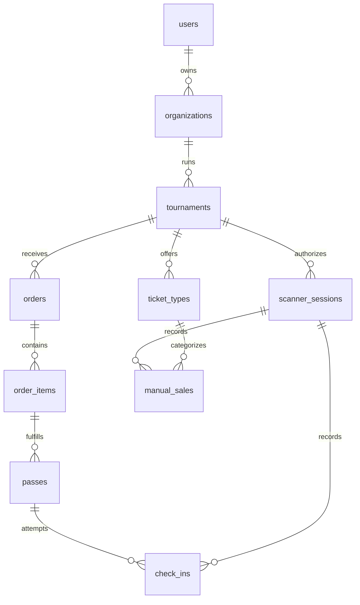

# TourniBase Database Schema

Last verified against the live Supabase project: July 4, 2026

Current production migration:
`20260704041441_add_phase_13_dashboard_metrics`

## Relationship summary

## Tables

### `users`

Director profile linked one-to-one to `auth.users`.

Key fields: `id`, `name`, `email`, `role`, `created_at`.

The current `user_role` enum contains only `director`.

### `organizations`

Ownership boundary for director data.

Key fields: `id`, `name`, `owner_user_id`, `created_at`.

Deleting a user cascades to that user’s organizations.

### `tournaments`

Admission event and public buyer-page configuration.

Key fields: `id`, `organization_id`, `name`, `sport`, `start_date`,
`end_date`, `venue_name`, `venue_address`, `organizer_name`,
`contact_email`, `description`, `status`, `public_slug`, `time_zone`,
`created_at`.

`sport` defaults to `youth_basketball`. `time_zone` defaults to
`America/New_York`.

### `ticket_types`

Purchasable admission options for one tournament.

Key fields: `id`, `tournament_id`, `name`, `price`, `valid_from`,
`valid_until`, `description`, `quantity_limit`, `status`, `created_at`.

Ticket validity is stored as exact `timestamptz` values after converting the
tournament’s calendar dates through its IANA time zone.

### `orders`

Buyer and payment record for one Stripe Checkout Session.

Key fields: `id`, `tournament_id`, `buyer_name`, `buyer_email`,
`buyer_phone`, `buyer_team_name`, `stripe_checkout_id`, `amount_total`,
`payment_status`, `created_at`.

The app formats order IDs as `TB-000001`, but the stored primary key is numeric.

### `order_items`

Immutable ticket snapshots created before Stripe Checkout.

Key fields: `id`, `order_id`, `ticket_type_id`, `ticket_name`,
`unit_amount_cents`, `quantity`, `valid_from`, `valid_until`, `created_at`.

Snapshots prevent later ticket edits from changing a completed order’s name,
price, quantity, or validity.

### `passes`

One individually scannable admission generated for each purchased unit.

Key fields: `id`, `order_id`, `order_item_id`, `sequence_number`,
`tournament_id`, `ticket_type_id`, `public_token`, `status`, `valid_from`,
`valid_until`, `uses_allowed`, `created_at`.

`public_token` is a random UUID used by the mobile pass page and QR code. The
unique `(order_item_id, sequence_number)` constraint makes fulfillment
idempotent.

### `scanner_sessions`

Temporary gate credentials created by a director.

Key fields: `id`, `tournament_id`, `gate_name`, `token_hash`, `permissions`,
`expires_at`, `staff_label`, `created_by`, `created_at`, `last_active_at`,
`revoked_at`.

Only a SHA-256 hash of the random scanner token is stored.

### `check_ins`

Append-only audit record for camera and manual validation attempts.

Key fields: `id`, `pass_id`, `tournament_id`, `scanner_session_id`,
`gate_name`, `result`, `source`, `attempted_token_hash`, `override_reason`,
`created_at`, `undone_at`, `undone_by_scanner_session_id`.

`pass_id` may be null only for an invalid token that cannot be matched safely to
a pass. Invalid raw tokens are not stored.

### `manual_sales`

In-person admission sales recorded outside TourniBase checkout.

Key fields: `id`, `tournament_id`, `scanner_session_id`, `ticket_type_id`,
`quantity`, `payment_method`, `amount`, `buyer_name`, `notes`, `created_at`.

These rows affect reporting but do not create Stripe charges or digital passes.

## Enum values

| Enum | Values |
| --- | --- |
| `user_role` | `director` |
| `tournament_status` | `draft`, `published`, `closed`, `archived` |
| `ticket_type_status` | `active`, `inactive`, `sold_out` |
| `order_payment_status` | `pending`, `paid`, `failed`, `refunded`, `partial_refund` |
| `pass_status` | `active`, `checked_in`, `refunded`, `voided`, `expired` |
| `check_in_result` | `valid`, `already_used`, `wrong_day`, `invalid`, `refunded`, `voided`, `manual_check_in`, `override` |
| `manual_sale_payment_method` | `cash`, `venmo`, `card_outside_tournibase`, `comp` |

## Database functions

| Function | Purpose | Execution |
| --- | --- | --- |
| `validate_pass_for_entry` | Authoritative pass validation and atomic admission | Server secret key only |
| `override_duplicate_pass_entry` | Records a reasoned duplicate override | Server secret key only |
| `undo_pass_check_in` | Undoes an eligible check-in and recalculates pass state | Server secret key only |
| `lookup_gate_orders` | Searches buyer/order data within one scanner tournament | Server secret key only |
| `get_recent_scans` | Returns recent activity for one scanner session | Server secret key only |
| `record_gate_sale` | Validates and records an in-person sale | Server secret key only |
| `get_tournament_dashboard_metrics` | Aggregates director sales and gate reporting | Signed-in owning director |

All listed functions run as security invoker. The gate functions have execution
revoked from anonymous and authenticated browser roles. Dashboard metrics remain
subject to director ownership checks and RLS.

The private `handle_new_auth_user` trigger function creates a protected
`public.users` profile when an invited Auth user is created.

## Row Level Security

RLS is enabled on all 10 public application tables.

- A director can access only their own profile and data reachable through an
  organization they own.
- Anonymous users can select only published tournaments and active ticket
  types.
- Orders, order items, passes, scanner sessions, check-ins, and manual sales
  have no anonymous read policy.
- Server-side fulfillment and gate operations use the Supabase secret key after
  application-level validation.

The schema uses explicit Data API grants because new Supabase projects no longer
automatically expose new public tables.

## Migration history

1. `20260702014637_create_mvp_foundation`
2. `20260702230156_add_order_items_and_pass_fulfillment`
3. `20260702230249_make_pass_fulfillment_constraint`
4. `20260703155919_add_scanner_session_revocation`
5. `20260703211839_add_phase_9_validation_engine`
6. `20260703212858_index_check_in_undo_sessions`
7. `20260703223158_add_phase_10_manual_lookup`
8. `20260703225254_add_tournament_time_zone`
9. `20260703225316_add_phase_11_recent_scans`
10. `20260703232057_add_phase_12_gate_sales`
11. `20260704041441_add_phase_13_dashboard_metrics`

Migration files are the source of truth under `supabase/migrations`. New schema
changes must be added as migrations and applied with `supabase db push`.

Production and local migration histories match these 11 migrations.
`supabase/seed.sql` adds local service-role table and sequence permissions but
contains no demo records and does not add migration history.
