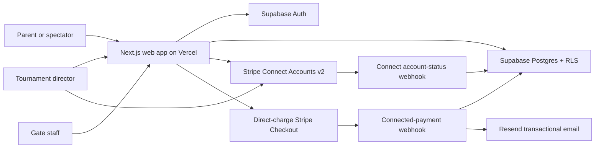

# TourniBase Web MVP Architecture

Last verified: July 16, 2026

## System overview

The application is a Next.js App Router project deployed on Vercel. Supabase
provides password authentication and Postgres storage. Stripe hosts the payment
form. The browser never receives the Supabase secret key or Stripe secret keys.

## Main components

### Next.js and Vercel

- Server Components load protected director data and public event/pass data.
- Server Actions handle authenticated director and scanner mutations.
- Route Handlers create Stripe Checkout Sessions and receive Stripe webhooks.
- Client Components are limited to interactive forms, QR scanning, copying, and
  mobile gate controls.
- `proxy.ts` refreshes Supabase authentication cookies. Protected pages also
  re-check authorization on the server.

### Supabase

- Supabase Auth stores director identities.
- The `public.users` row is created from an Auth user through a private trigger.
- Postgres stores organizations, tournaments, tickets, orders, passes, scanner
  sessions, check-ins, and manual sales.
- Row Level Security limits directors to organizations they own.
- Anonymous access is limited to published tournaments and their active ticket
  types.
- Sensitive gate functions are callable only by the server-side Supabase secret
  key.

### Stripe Connect

- TourniBase's existing Stripe account is the Connect platform.
- Each organization has one Accounts v2 connected account in each Stripe
  environment.
- Directors complete Stripe-hosted onboarding. Connected accounts receive the
  full Stripe Dashboard; TourniBase does not support switching or disconnecting
  accounts during the pilot.
- Event organizers are the sellers and merchants of record.
- Checkout Sessions are direct charges on the order's connected account.
- Stripe processing fees and payout timing belong to the connected account.
- TourniBase calculates an optional percentage-plus-fixed application fee. Both
  fee settings are `0` during the pilot.
- The app stores the connected account, environment, fee, PaymentIntent, and
  charge on the order so later API calls cannot route to a different merchant.
- Connected-payment and account-status webhook signatures are verified against
  separate secrets and the raw request body.
- A connected-payment event must identify the same connected account stored on
  the order before fulfillment or refund synchronization can continue.
- Full refunds and pass-specific partial refunds run against the connected
  account and reverse the related application fee.
- Pass-specific partial refunds created in TourniBase mark the order as
  partially refunded, subtract the refund from net revenue, and void the
  selected pass. Generic partial refunds created directly in Stripe update the
  order total but cannot identify which pass to void.
- Test mode remains active until production launch checks are complete.

### Transactional email

- React Email renders one branded order email containing every mobile pass
  link plus a plain-text fallback.
- The provider-neutral delivery layer uses the Resend SDK in production.
- The sending-only key stays server-side, and `tournibase.com` is the verified
  sender domain.
- Production sends through Resend from `passes@tournibase.com`.
- `EMAIL_PROVIDER=disabled` keeps local development from sending real email.
- Postgres tracks delivery status and atomically claims each order so concurrent
  webhook requests cannot send duplicates.
- Provider errors do not undo payment or pass creation. Temporary failures can
  be retried; permanent failures remain recorded for support.

## Route map

### Public and buyer routes

| Route | Purpose |
| --- | --- |
| `/` | Product introduction |
| `/login` | Director password login |
| `/e/[event-slug]` | Public tournament pass purchase |
| `/share/[event-slug]` | Coach and parent sharing page |
| `/order/success` | Payment confirmation and pass links |
| `/p/[pass-token]` | Individual mobile pass |
| `/p/[pass-token]/save` | Buyer-friendly offline save page |
| `/p/[pass-token]/offline-pass.png` | Downloadable offline QR pass image |

### Director routes

| Route | Purpose |
| --- | --- |
| `/dashboard` | Director tournament list |
| `/dashboard/tournaments/new` | Create a tournament |
| `/dashboard/tournaments/[id]` | Tournament overview |
| `/dashboard/tournaments/[id]/edit` | Edit event details |
| `/dashboard/tournaments/[id]/tickets` | Manage ticket types |
| `/dashboard/tournaments/[id]/gate` | Create and revoke scanner links |
| `/dashboard/tournaments/[id]/sales` | Sales dashboard |
| `/dashboard/tournaments/[id]/scans` | Gate-activity dashboard |
| `/dashboard/tournaments/[id]/share` | Coach and parent sharing tools |
| `/dashboard/settings` | Director profile and organization payment onboarding/status |
| `/print/tournaments/[id]/gate-poster` | Legacy printable buyer checkout poster |

### Gate routes

| Route | Purpose |
| --- | --- |
| `/scan/[scanner-token]` | Camera scanner and pass validation |
| `/scan/[scanner-token]/lookup` | Buyer/order lookup and manual check-in |
| `/scan/[scanner-token]/recent` | Persisted activity for that scanner |
| `/scan/[scanner-token]/sale` | Record an in-person sale |

### API routes

| Route | Purpose |
| --- | --- |
| `POST /api/checkout` | Validate an order and create Stripe Checkout |
| `POST /api/stripe/webhook` | Verify legacy or connected payment events, fulfill orders, and sync refunds |
| `GET/POST /api/stripe/connect/start` | Create a connected account when authorized and open hosted onboarding |
| `GET/POST /api/stripe/connect/refresh` | Synchronize Connect status and return to settings |
| `POST /api/stripe/connect/dashboard` | Open the exact connected account in Stripe Dashboard |
| `POST /api/stripe/connect/webhook` | Synchronize account status, capabilities, requirements, and closure |
| `POST /api/stripe/dashboard-payment` | Open a connected order's payment in the correct Stripe Dashboard |

## Tournament setup flow

1. A signed-in director submits the create-tournament Server Action.
2. If the director has no organization, the app creates one owned by that
   director.
3. The tournament is inserted as `draft` with a collision-safe public slug.
4. Ticket Server Actions create or edit ticket types after ownership and date
   checks.
5. Publishing is blocked until at least one active ticket type exists. If any
   active ticket is paid, the organization's current-environment connected
   account must be ready for both charges and payouts.
6. Only published tournaments and active ticket types are visible to anonymous
   buyers.
7. A published event stays visible if its connected account later becomes
   restricted, but paid ticket options and paid checkout are disabled. Free
   ticket options remain available.

## Purchase and pass-creation flow

1. `POST /api/checkout` validates the event, ticket IDs, quantities, inventory,
   and buyer fields.
2. The server requires the event organization's connected account to be ready
   for paid carts and creates a pending `orders` row, immutable `order_items`,
   and immutable payment-routing fields.
3. The server creates a direct-charge Stripe Checkout Session on the connected
   account with the TourniBase order ID in metadata and an application fee only
   when the configured fee is greater than zero.
4. Stripe redirects the buyer to hosted Checkout.
5. Stripe sends a signed success event to `/api/stripe/webhook`.
6. `fulfillCheckoutSession` requires the event's connected account and mode to
   match the order, retrieves the Checkout Session from that connected account,
   and continues only when Stripe reports `paid`.
7. The function upserts one `passes` row per purchased admission using the
   unique order-item and sequence-number pair.
8. The order changes to `paid`.
9. The webhook creates or claims the order’s protected email delivery record.
10. If a provider is active, TourniBase sends one email containing every pass
    link with a deterministic idempotency key.
11. `/order/success` calls the same idempotent fulfillment function before
   showing pass links. This safely handles a fast redirect or a webhook retry.

Supported webhook events:

- `checkout.session.completed`
- `checkout.session.async_payment_succeeded`
- `checkout.session.async_payment_failed`
- `checkout.session.expired`
- `charge.refunded`

## Refund sync flow

1. A director uses the TourniBase order detail view for full-order or
   pass-specific refunds. The payment-specific Stripe Dashboard link is for
   review and reconciliation.
2. Stripe sends `charge.refunded` to `/api/stripe/webhook`.
3. The webhook verifies the Stripe signature.
4. TourniBase verifies the event account matches the immutable order routing,
   retrieves the latest Stripe charge from that connected account, then
   resolves the order ID from Stripe metadata on the charge or PaymentIntent.
5. A full refund marks the order as `refunded` and marks active or checked-in
   passes as `refunded`.
6. A pass-specific partial refund created in TourniBase marks the order as
   `partial_refund` and voids the selected pass. A generic partial refund made
   directly in Stripe updates refunded revenue but leaves passes usable because
   Stripe does not identify a specific pass.
7. TourniBase sends the buyer a refund confirmation email through Resend.
8. Any application fee is reversed with the refund. The pilot fee is $0.

## Mobile pass flow

Each pass has a random UUID `public_token`. Its page is
`/p/[pass-token]`, and its QR code represents that pass link/token.

The page is resolved on the server and is shown only when its related order is
paid. Orders and passes are not anonymously readable through the Supabase Data
API.

The success page displays every pass link. The branded email template, delivery
tracking, duplicate protection, and retry states are live through Resend.

The success page, mobile pass page, and order email each link to
`/p/[pass-token]/save`. That page explains how to save the backup QR image to
Photos or Files and keeps a direct PNG download as a fallback. The PNG endpoint
is private, no-store, and generated only after the server verifies the order and
confirms the pass has not been refunded or voided. The saved image remains
available when the buyer’s phone has no internet. The scanner still requires
internet because current pass status, validity, and prior use must be checked
against the database.

## Scanner authorization

1. A director creates a scanner session for one tournament and gate.
2. The server generates a random 256-bit scanner token.
3. Only the SHA-256 hash is stored in `scanner_sessions`.
4. The raw scanner link is shown once to the director.
5. Each scanner request hashes the URL token and checks the matching session,
   expiration, revocation, tournament, and permission set.

Available permission levels combine:

- QR/pass scanning
- Buyer and order lookup
- Recent activity
- Gate-sale recording

## Pass validation and duplicate blocking

The scanner sends the parsed pass token to a Server Action. The server calls
`validate_pass_for_entry`, which runs inside Postgres and locks the pass row
during validation.

The function verifies:

- The scanner session exists, is active, and belongs to the tournament
- The pass belongs to that tournament
- The order is paid
- The pass status allows admission
- The pass is valid at the current tournament-local date and time
- The number of successful admissions is below `uses_allowed`

A successful admission inserts a `check_ins` row and updates the pass atomically.
Concurrent scans cannot both consume the same remaining use.

A later scan returns `already_used`. Authorized staff may call
`override_duplicate_pass_entry` with a required reason. An eligible check-in can
be undone by the same scanner session through `undo_pass_check_in`.

Invalid tokens are audited using a SHA-256 attempt hash; the raw invalid token is
not stored.

## Manual lookup and gate sales

The lookup flow searches only orders for the scanner’s tournament. Eligible
passes use the same validation function as camera scans, so manual check-in does
not bypass duplicate or date rules.

The gate-sale flow uses `record_gate_sale`. Postgres re-checks the scanner
session, permission, ticket ownership, ticket status, and quantity before
recording the sale. The amount is calculated from the current ticket price.
This is reporting-only and does not process payment.

## Time zones

- Each tournament stores an IANA time zone.
- New tournaments default to `America/New_York`.
- Ticket dates become exact UTC validity windows using the tournament time
  zone.
- Buyer, pass, scanner, lookup, recent-scan, and dashboard displays use the
  tournament time zone.
- Device location and VPN usage do not change admission validity.

## Security boundaries

- `NEXT_PUBLIC_SUPABASE_PUBLISHABLE_KEY` is safe for browser use because RLS
  controls accessible rows.
- `SUPABASE_SECRET_KEY`, `STRIPE_SECRET_KEY`, and
  `STRIPE_WEBHOOK_SECRET` are server-only.
- Email delivery records and the claim function have no anonymous or
  authenticated browser access.
- Director authorization is enforced in server code and RLS, not only in
  `proxy.ts`.
- Scanner URLs act as temporary gate credentials and can be expired or revoked.
- Stripe card information never passes through TourniBase.
- Pass pages and scanner pages are marked to avoid search indexing.

See [Database Schema](./database-schema.md) for the current tables, functions,
and access model.
